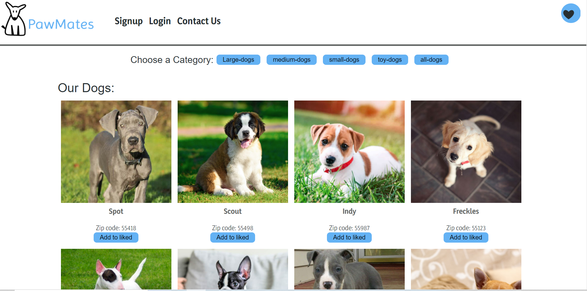

# Pawmates
## Description

For this group project, we built a web app that securely stores and screens puppy owners for the purpose of setting up playdates with other puppy owners.
The motivation for development was to socialize dogs and puppies with other dogs and people, as well as to create new puppy friends for puppy owners around the twin cities.

## Deployed link:

Here is a link to the [Pawmates](https://blooming-sea-72264.herokuapp.com/)

## Final product overview

web page

## User story

As a User 
AS A Puppy owner 
I WANT TO schedule playdates for my puppy 
 SO THAT I can socialize and befriend new puppies in my local area.

## Credits

Pawmates is created and maintained by Ethan, Dillon, Jorge, Lauren, & Tuyet

## Future Improvements

Add application process for new users where users can enter their puppy information in a form 
Add a messaging feature, user to user, profile to profile 
Geolocation with google maps api so users can see locations of puppies 
Message board for all the users. 
Add a scheduling feature (via a calendar api or built calendar) that allows users to see other users availability for a puppy playdate 

## License

MIT License
Copyright (c) 2021 Dillon Smith
Permission is hereby granted, free of charge, to any person obtaining a copy
of this software and associated documentation files (the "Software"), to deal
in the Software without restriction, including without limitation the rights
to use, copy, modify, merge, publish, distribute, sublicense, and/or sell
copies of the Software, and to permit persons to whom the Software is
furnished to do so, subject to the following conditions:
The above copyright notice and this permission notice shall be included in all
copies or substantial portions of the Software.
THE SOFTWARE IS PROVIDED "AS IS", WITHOUT WARRANTY OF ANY KIND, EXPRESS OR
IMPLIED, INCLUDING BUT NOT LIMITED TO THE WARRANTIES OF MERCHANTABILITY,
FITNESS FOR A PARTICULAR PURPOSE AND NONINFRINGEMENT. IN NO EVENT SHALL THE
AUTHORS OR COPYRIGHT HOLDERS BE LIABLE FOR ANY CLAIM, DAMAGES OR OTHER
LIABILITY, WHETHER IN AN ACTION OF CONTRACT, TORT OR OTHERWISE, ARISING FROM,
OUT OF OR IN CONNECTION WITH THE SOFTWARE OR THE USE OR OTHER DEALINGS IN THE